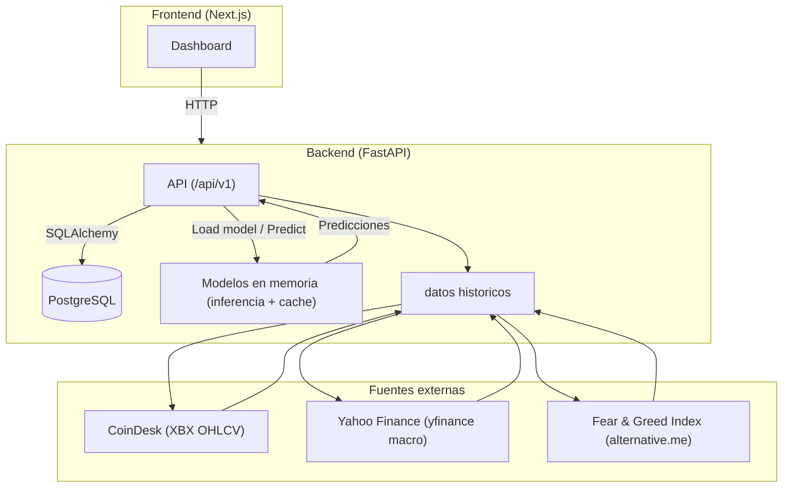

# MVP App (monorepo)

Esta carpeta agrupa todo lo relacionado con el desarrollo del MVP de forecasting de Bitcoin.

## Estructura
```
mvp/
  backend/
  frontend/
  experiments/
```

## Arquitectura de alto nivel MVP

A continuación se muestra la arquitectura de alto nivel del MVP en formato Mermaid. El backend se representa como un único bloque que encapsula la API, la base de datos PostgreSQL y los modelos de predicción en memoria, y se comunica con el frontend vía HTTP.



## Alcance del MVP
- Datos:
  - OHLCV histórico (BTC) desde CoinDesk (índice XBX).
  - Fear & Greed Index (FGI) diario desde `https://api.alternative.me/fng/`.
  - Series macro (Yahoo Finance vía `yfinance`): `sp500`, `dxy`, `vix`, `gold` + retornos y volatilidades.
  - Features calculadas (técnicas + macro + FGI) para entrenamiento e inferencia.
- Persistencia: PostgreSQL como fuente de verdad para históricos, features, modelos y predicciones.
- Backend: FastAPI para ingesta incremental, serving de datos y gestión de modelos/predicciones.
- Frontend: Next.js + Tailwind + shadcn/ui para visualización.
